<h1 align="center">NexoTV-Enhanced</h1>

<p align="center"><strong><a href="README.md">🇫🇷 Version française</a></strong></p>

<p align="center">
  <strong>Stremio IPTV addon — <em>live TV channels</em> first, plus Movies &amp; Series catalogs,
  multi-source, category selection, authentication and saved configurations.</strong>
</p>

> **The core stays IPTV: live TV channels.** The addon streams your live channels (Xtream,
> M3U/M3U+, IPTV-org) in Stremio; Movies & Series catalogs (Xtream) come **on top**.

<p align="center">
  <a href="https://upandclear.org/2026/06/24/nexotv-enhanced/">
    
  </a>
</p>

> Overview, install guide and screenshots: **[upandclear.org — NexoTV Enhanced](https://upandclear.org/2026/06/24/nexotv-enhanced/)**

---

## Project origin (attribution)

This repository is an **enhanced fork** of **[joaosavi/nexotv](https://github.com/joaosavi/nexotv)**,
created by [@joaosavi](https://github.com/joaosavi) and distributed under the **MIT** license.

All credit for the original addon (architecture, Xtream / M3U / IPTV-org providers, EPG, cache,
SSRF protection, etc.) goes to its author. This repository **keeps the MIT license** and adds
features on top of the upstream code.

- Upstream source: https://github.com/joaosavi/nexotv
- Full original documentation (detailed deployment, all env vars, EPG…):
  **[README.upstream.md](README.upstream.md)**

---

## What this version adds

| Area | Addition |
|---|---|
| **Live TV channels** | The core: streams your **live TV channels** (Xtream, M3U/M3U+, IPTV-org, Stalker) in Stremio, with EPG, logos and search. *(upstream foundation, preserved.)* |
| **Multi-source** | Add **several** Xtream/M3U sources mixed into the same catalogs, with **Movies/Series de-duplication** and per-source stream choice. |
| **Categories** | The webui loads the feed's categories, **labels them by type** (TV / Movies / Series) and lets you **pick** which ones to keep (filter, all / none / invert). |
| **Catalogs** | 3 layouts: a single catalog, one per category, or **custom catalogs** (named groups of categories). |
| **Home / Discover** | Choose, per catalog, which ones show on the **home** board; the others stay accessible via **Discover**. |
| **Movies & Series (Xtream)** | Movies/Series categories become **real playable Stremio catalogs** (`movie` / `series`, series with **seasons + episodes**). |
| **M3U** | `/movie/` entries are exposed as `movie` catalogs (direct playback). |
| **Stalker** | **Stalker / Ministra** portal (MAC auth) as a **live TV + movies (VOD) + series** source (single **and** multi-source); movies/series TMDB-enriched and de-duplicated, streams resolved on play via `create_link`. |
| **Search** | Accent/separator-insensitive matching (`tf 1` ≈ `TF1`, `asterix` ≈ `Astérix`). |
| **Authentication** | Optional **single password** on the webui. |
| **Saved configs** | **Server-side saved configurations** (named, reloadable). |
| **Synopsis** | Movies & series with **synopsis** (genres, cast, director, year) fetched when opening the detail page. |
| **TMDB enrichment** | TMDB key (entered in the webui) → posters/synopsis/cast **via TMDB** for Movies & Series, with **fallback to provider data** when a title isn't found. |
| **Language** | **EN / FR** switch in the header (remembered in the browser). |
| **Display** | Channel logos as square posters; addon name `NexoTV-Enhanced`. |

> Fully **backward-compatible**: with no category selection, behaviour matches the original addon
> (all channels, one catalog).

---

## Screenshots

### Configuration (webui)

| | |
|---|---|
| 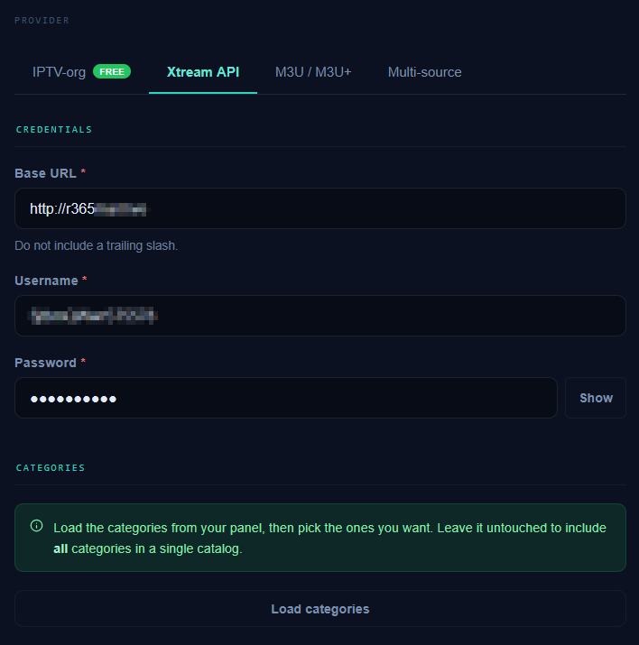 | 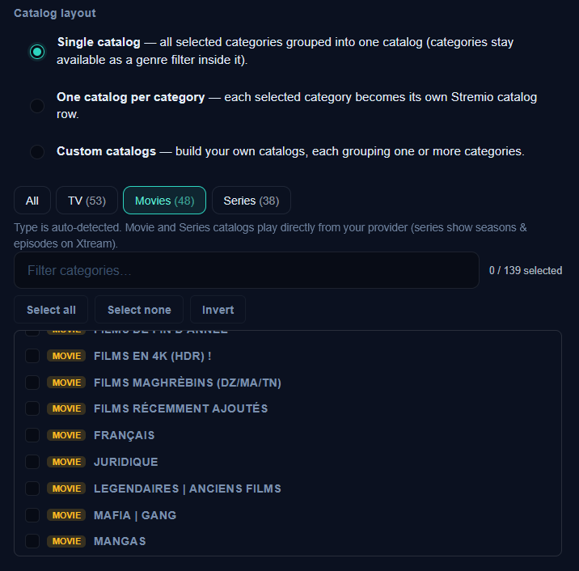 |
| **Xtream API** tab: credentials, then *Load categories*. | Layout + **type filter** (TV / Movies / Series). |
| 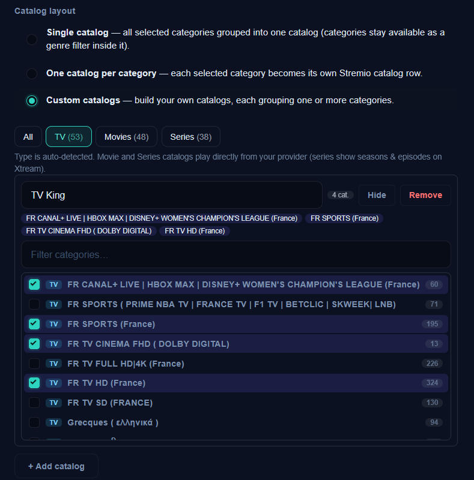 | 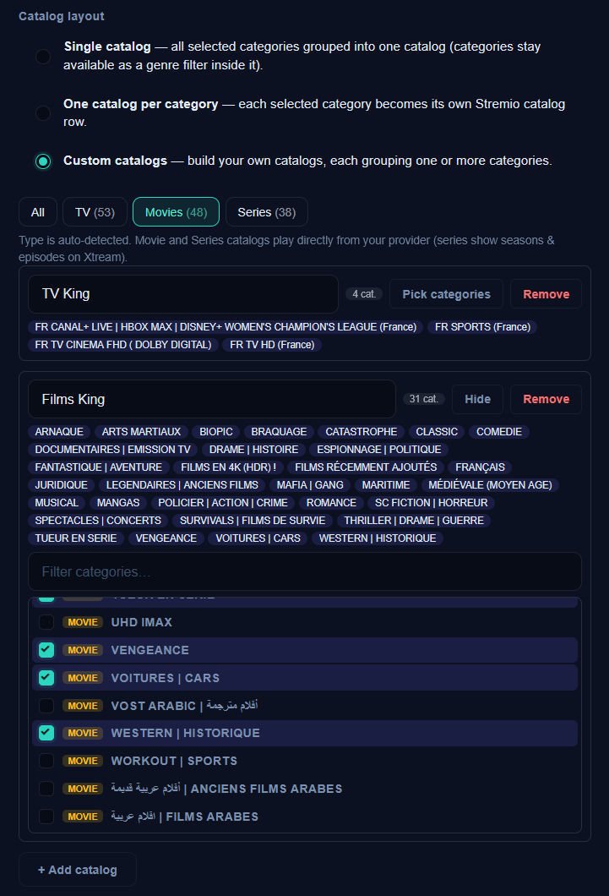 |
| **Custom catalogs** mode: a "TV King" catalog. | Two catalogs "TV King" and "Films King". |
| 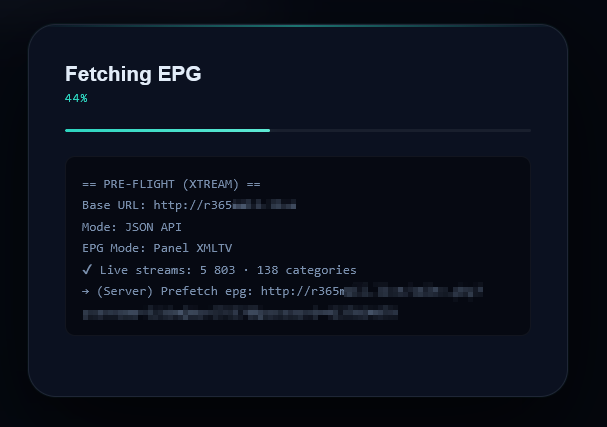 | 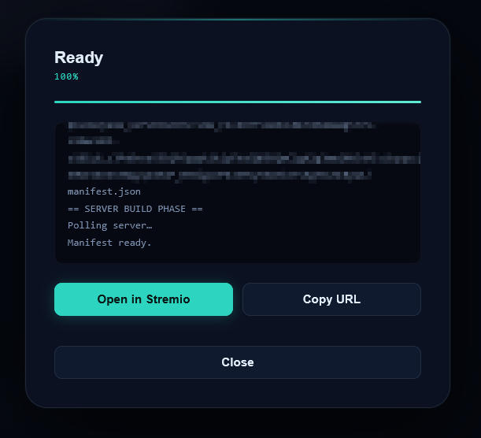 |
| Install overlay (Xtream pre-flight, EPG). | Manifest ready → *Open in Stremio* / *Copy URL*. |

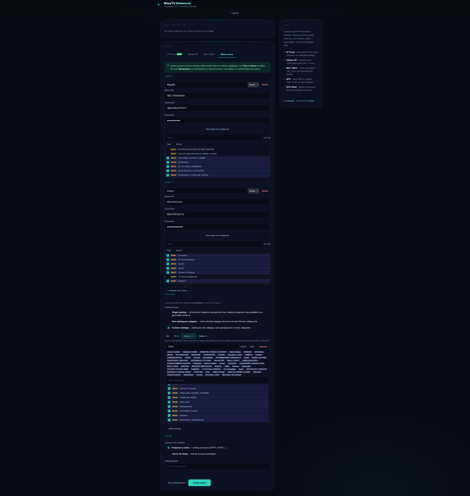

*The **Multi-source** tab: two sources (King365 + Pierot), custom catalogs and playback choice (offer the choice / play the first available).*

### Stremio

| | |
|---|---|
| 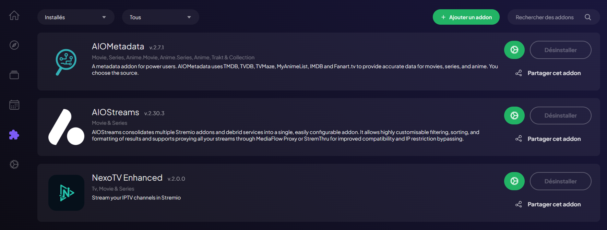 | 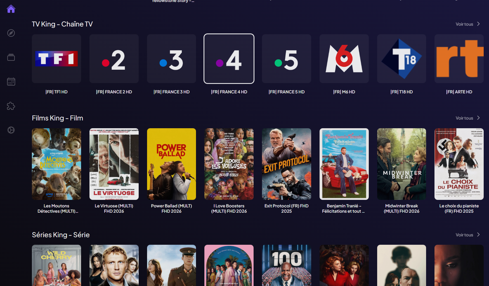 |
| **NexoTV Enhanced** addon installed. | Catalogs TV King / Films King / Séries King. |
| 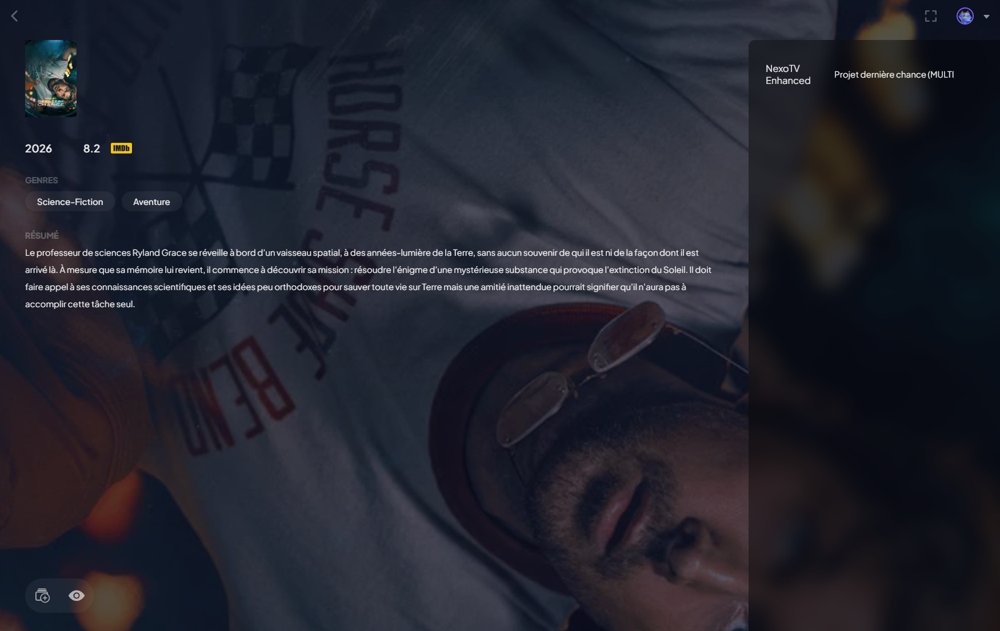 | 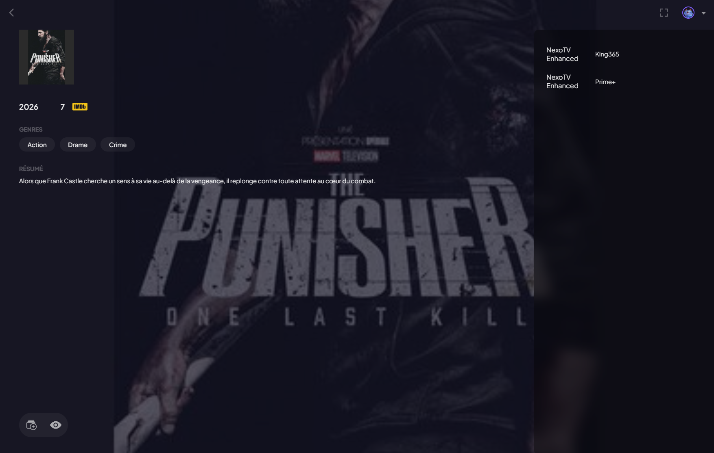 |
| Movie detail with **synopsis**, rating and genres. | One movie, **two streams** (King365 / Prime+) — multi-source. |

### Nuvio

| | | |
|---|---|---|
| 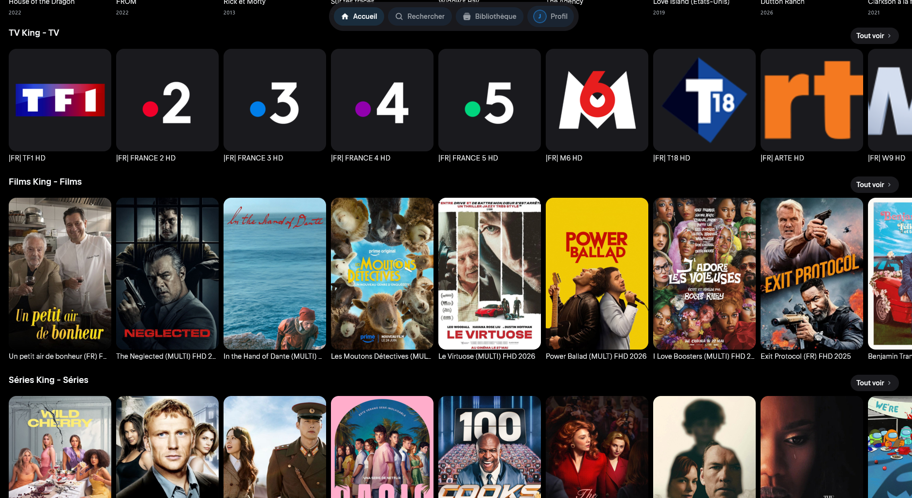 | 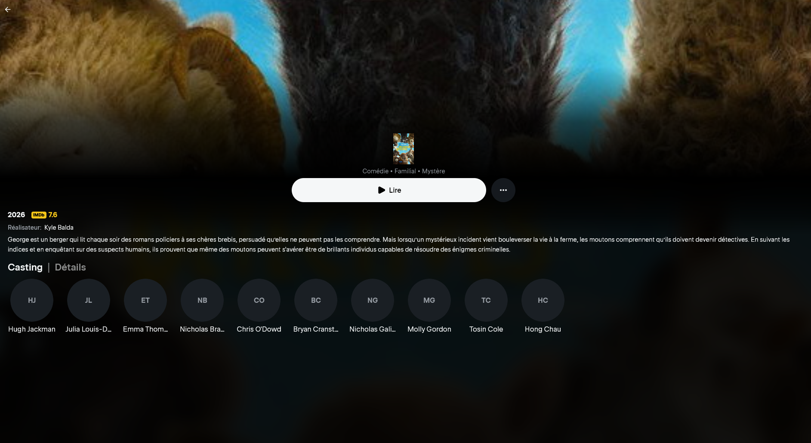 | 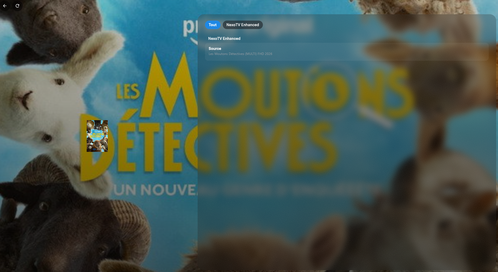 |
| Home: TV King / Films King / Séries King. | Movie detail: *Play*, cast. | Playback (source NexoTV Enhanced). |

---

## Features in detail

### Categories & catalogs

1. Configuration page (`/configure`) → **Xtream API** or **M3U / M3U+** tab → enter the
   credentials / playlist URL.
2. **Categories** section → **Load categories**: the list shows, for each category, a
   **TV / Movie / Series** badge and the channel count.
   - Xtream: types read from `get_live/vod/series_categories`.
   - M3U: types inferred from the URL path (`/live/` `/movie/` `/series/`).
3. Check the categories you want, then choose the **layout**:
   - **Single** — all categories in one catalog (categories remain an internal genre filter);
   - **Split** — one catalog per category;
   - **Custom** — named catalogs, each grouping the categories of your choice.
4. **On the home screen** section: tick the catalogs to show on the Stremio **home** board; unticked
   ones stay accessible via **Discover** only (technically: a required genre → off the board but
   present in Discover).
5. **Install Addon**: the selection is encoded (and **compressed**) into the config token,
   encrypted when `CONFIG_SECRET` is set.

### Movies & Series (Xtream)

Selecting a **Movies** or **Series** category in Xtream creates a typed Stremio catalog:

- **Movies** → `movie` type, direct file playback (`/movie/USER/PASS/id.ext`).
- **Series** → `series` type: the detail page shows **seasons + episodes**, loaded on open via
  `get_series_info` (no mass prefetch), each episode playable.

The catalog type follows the category type: *split* → one catalog per category (of the right type);
*custom* → one catalog per group (dominant type); *single* → one catalog **per type**
(TV / Movies / Series). On **M3U**, movies (`/movie/`) become `movie` catalogs; series stay flat
(an M3U carries no season/episode structure).

> In Stremio/Nuvio, catalogs are grouped **by type**: a Movies catalog appears under
> *Discover → Movies*, a Series catalog under *Discover → Series*.

### Stalker / Ministra (live TV + movies + series)

**Stalker** tab (and a **Stalker** option in multi-source): enter the **portal URL** and **MAC
address**, click **Load categories**, then select and build catalogs like any other provider. The
webui labels each category's **type** (TV / Movies / Series).

- **Handshake + token** authentication (MAC), `/c/portal.php` path auto-detected.
- TV categories = **ITV genres**; **Movie** = portal **VOD**; **Series** = `type=series`; lists
  paginated via `get_ordered_list`.
- **Stalker movies and series are playable**: synopsis + `tmdb_id` come from the portal, enriched
  via **TMDB** (key entered in the webui) with a fallback to portal data.
- **Series**: seasons and episodes fetched via `movie_id`; each episode is resolved on play via
  `create_link&type=vod` with the season's `cmd` + the episode number.
- Stalker stream URLs are **dynamic**, so they are resolved **on play** via `create_link`
  (TV `type=itv`, movies/episodes `type=vod`; ephemeral play token).
- In multi-source, **Stalker movies and series de-duplicate** with Xtream/M3U ones sharing the same
  title (several sources → one entry, multiple links; episodes merged by season/number).

### TMDB enrichment (movies & series)

Enter a **TMDB API key** in the webui (*Metadata (TMDB)* section) to fetch **rich metadata**
(poster, synopsis, genres, cast, rating) on Movie & Series detail pages.

- Prefers the panel's **`tmdb_id`** (exact match); otherwise **TMDB search by title + year**.
- **Always falls back**: if TMDB finds nothing (messy naming, content not on TMDB…), the **provider
  data is kept** → nothing is lost.
- Configurable language (FR/EN). TMDB responses are cached (~7 days).
- Optional: without a key, behaviour is unchanged (provider metadata).

> The key can also be set globally on the server via `TMDB_API_KEY` (the webui key takes priority).

### Authentication (single password)

- Enabled only when **`WEBUI_PASSWORD`** is set (otherwise the UI is open — backward-compatible).
- Protects the configuration page and its endpoints (`/encrypt`, `/api/prefetch`).
- **Addon/stream endpoints stay public** (Stremio/Nuvio cannot authenticate).
- Session via a **signed HMAC cookie** (HttpOnly, SameSite=Lax, Secure behind HTTPS), 30-day default
  (`WEBUI_SESSION_TTL_MS`), constant-time password comparison, rate-limited `/api/login`.

### Saved configurations (server-side)

- **Save configuration** button in each provider → stores the current config under a name.
- **Saved configurations** panel: **Load** (restores the form via `/{token}/configure`) / **Delete**.
- Stored in **SQLite** (`data/`, persisted via the Docker volume), **encrypted at rest** when
  `CONFIG_SECRET` is set. With a single password, these configs are **shared** (no separate accounts).

### Multi-source (mixing + de-duplication)

**Multi-source** tab: add several named sources (Xtream / M3U), load and select categories
**per source**, then pick the layout (combined by type / one catalog per category) and the
**playback behaviour**.

- **Mixing**: all selected channels from the sources are merged into the catalogs.
- **Movies/Series de-duplication**: identical titles (after normalization: lowercase, no accents,
  no `HD/4K/1080p/MULTI/VF…` tags) are grouped into **one item** offering **one stream per source**.
  **TV channels** are not merged (listed per source, suffixed with the source name).
- **Series**: episodes merged by (season, episode) across sources (Xtream).
- **Playback** (`streamSelection`, set in the webui):
  - **Offer the choice** → Stremio lists one stream per source (IPTV1 / IPTVPerso…);
  - **Play the first available** → only the priority source's stream (source order).
- **Limitations**: no EPG in multi-source for now; on M3U, series stay flat (no season/episode tree),
  only M3U movies are de-duplicated.

> Single-source configs are unchanged and fully supported.

---

## Feed & catalog refresh

Data is fetched on demand then cached; catalogs always reflect the current channel list.

- **Auto-refresh** in the background every **4 h** (`UPDATE_INTERVAL_MS`) while the instance is
  active (circuit breaker after 3 failures).
- **Bootstrap**: the 1st catalog request after a (re)build forces a fresh fetch (unless <2 min).
- **Conditional requests** ETag / `If-Modified-Since` → `304 Not Modified` = no re-processing.
- **SQLite disk cache ~24 h** (`CACHE_TTL_MS`, `M3U_CACHE_TTL_MS`, `IPTV_ORG_CACHE_TTL_MS`),
  **RAM evicted after 5 min** of inactivity (`DATA_MEMORY_TTL_MS`).
- **EPG** refreshed every **8 h** (`EPG_UPDATE_INTERVAL_MS`).
- **Xtream VOD + series list**: fetched in the same call as live (same cadence). **Episodes** are
  loaded on demand each time a detail page is opened (always fresh).
- **Non-blocking install**: the manifest is served **immediately** and data is fetched in the
  **background** → no install timeout, even on a large panel or a heavy EPG.

The catalog **structure** (which catalogs, their types) is fixed by the token: it only changes by
**reconfiguring**.

---

## Deployment (Docker)

Multi-arch image (amd64/arm64) published on GHCR: `ghcr.io/aerya/nexotv-enhanced:latest`.

```yaml
# docker-compose.yml
services:
  nexotv:
    image: ghcr.io/aerya/nexotv-enhanced:latest
    container_name: nexotv-enhanced
    ports:
      - "7000:7000"
    env_file:
      - .env
    volumes:
      - ./data:/app/data     # persistence (cache + saved configs)
      - ./config:/app/config
    restart: unless-stopped
```

### Key environment variables

| Variable | Role | Default |
|---|---|---|
| `ADDON_NAME` | Name shown in Stremio/Nuvio | `NexoTV-Enhanced` |
| `CONFIG_SECRET` | Enables AES-256-GCM encryption of tokens **and** saved configs (≥16 chars) | *(none)* |
| `WEBUI_PASSWORD` | Webui password (empty = open UI) | *(none)* |
| `WEBUI_SESSION_TTL_MS` | Session lifetime | `2592000000` (30 d) |
| `TMDB_API_KEY` | **Global** TMDB fallback key (the webui key takes priority) | *(none)* |
| `TMDB_LANGUAGE` | Default TMDB language | `fr-FR` |
| `EPG_ENABLED` | Set to `false` to **disable EPG everywhere** (whatever each config's setting) | `true` |
| `UPDATE_INTERVAL_MS` | Channel auto-refresh interval | `14400000` (4 h) |
| `EPG_UPDATE_INTERVAL_MS` | EPG refresh interval | `28800000` (8 h) |
| `CACHE_TTL_MS` | Disk cache TTL | `86400000` (24 h) |

> See [`.env.example`](.env.example) and the [upstream README](README.upstream.md) for the full list.

---

## Quick start (dev)

```bash
pnpm install
pnpm dev        # backend (port 7000) + frontend (Vite) in parallel
```

Tests and checks:

```bash
pnpm --filter backend exec vitest run      # backend tests
pnpm --filter @nexotv/frontend build       # typecheck (vue-tsc) + build
```

---

## Technical notes

- **Dynamic manifest** ([`manifest.ts`](packages/backend/src/addon/manifest.ts)): `single` →
  `iptv_channels` (+ `iptv_movies` / `iptv_series` depending on types); `split` → `iptv_cat_<n>`;
  `custom` → `iptv_grp_<n>`. `types[]` computed dynamically.
- **Config fields**: `selectedCategories`, `catalogMode` (`single|split|custom`),
  `catalogGroups`, `categoryTypes`, `sources`, `streamSelection`.
- **Catalog/stream/meta resolution**: [`M3UEPGAddon.ts`](packages/backend/src/addon/M3UEPGAddon.ts)
  (`resolveCatalog`, `itemsForCatalog`, `parseId`, `buildSeriesMeta`).
- **Compressed (gzip) + encrypted token**: [`cryptoConfig.ts`](packages/backend/src/utils/cryptoConfig.ts).
- **Auth**: [`webauth.ts`](packages/backend/src/utils/webauth.ts) — **Config store**:
  [`configStore.ts`](packages/backend/src/utils/configStore.ts).
- **Frontend** (Vue 3): [`CategorySelector.vue`](packages/frontend/src/components/CategorySelector.vue),
  [`MultiSourceConfig.vue`](packages/frontend/src/components/MultiSourceConfig.vue),
  [`SavedConfigs.vue`](packages/frontend/src/components/SavedConfigs.vue),
  [`LoginGate.vue`](packages/frontend/src/components/LoginGate.vue).

---

## License

MIT — see [LICENSE](LICENSE). The original copyright of
[@joaosavi](https://github.com/joaosavi) is preserved; this fork's additions are released under the
same license.
